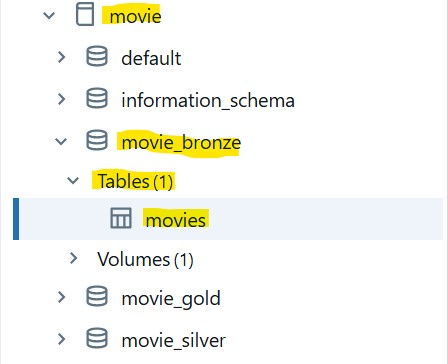
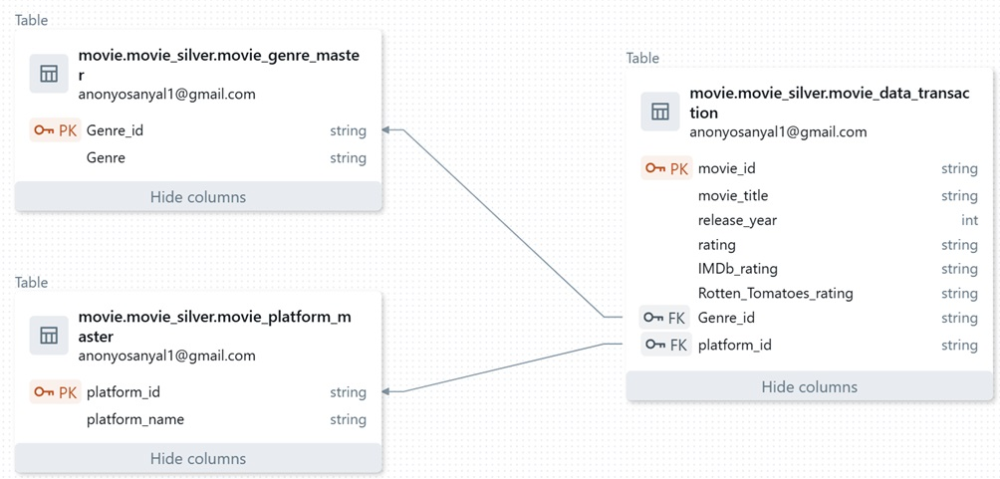
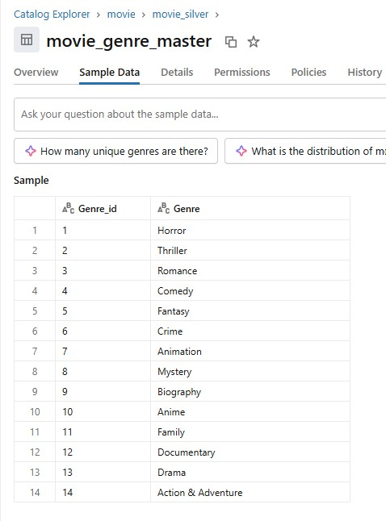
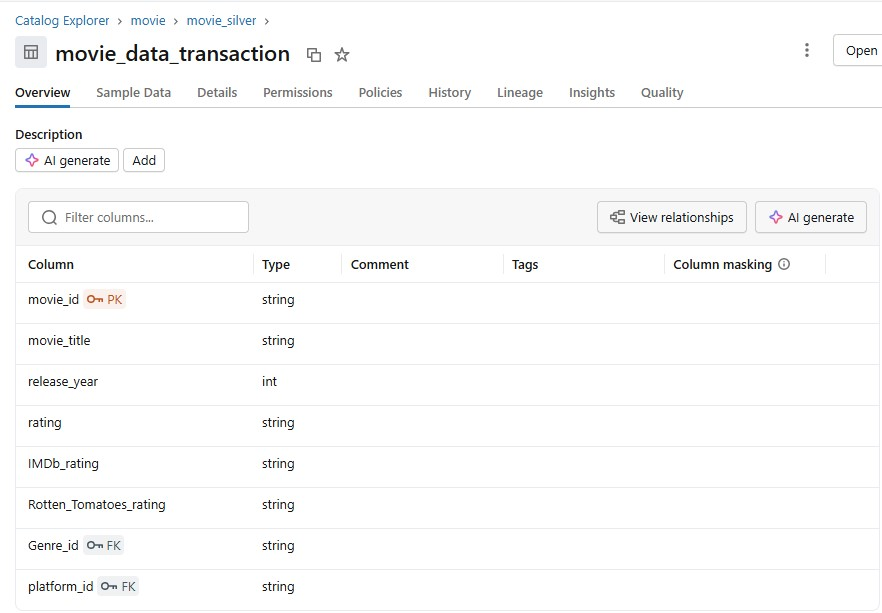

# Solution Details

## Source File Analysis

The source file to our project is a csv file containing rating and reviews of various movies. 
**Dataset URL:** https://www.kaggle.com/datasets/jyotmakadiya/popular-movies-and-tv-shows-amazon-prime-netflix  
**Path in project:** Documentation/Popular Movies TV shows from Prime Videos Netflix version_3.csv 
***** _Please note that in the code we have placed it in the Bronze Volumes movie.movie_bronze.dataset-movies to fetch the data._ *****  

It contains the following fields:-
<table>
<tr><th>Field</th><th> Description</th>
<tr><td>[Blank]</td><td>No definition for this field. Only obeservation is this field holds ID - 1 value</td></tr>
<tr><td>ID</td><td>Movie Id with values like 1,2,3,4...</td></tr>
<tr><td>Title</td><td>Name of Movie</td></tr>
<tr><td>Year</td><td>Year of Release</td></tr>
<tr><td>Rating</td><td>Age rating</td></tr>
<tr><td>IMDb</td><td>IMDb rating out of 5</td></tr>
<tr><td>Rotten Tomatoes</td><td>Rotten tomatoes rating out of 100</td></tr>
<tr><td>Genre</td><td>Genre under which movie is categorised</td></tr>
<tr><td>Netflix</td><td>Was the move released in Netflix? Value is 0 if No and 1 if Yes</td></tr>
<tr><td>Amazon Prime Video</td><td>Was the movie released in Amazon Prime Video? Value is 0 if No and 1 if Yes</td></tr>
</table>

## Creation of Medallion Architecture

**Notebook Path:** _Movie-Data-Engineering-Using-Databricks/Create medallion Architecture - movie/create medellion architecture for movies.ipynb_ 

With notebook we creating the Medallion Architecture. First we create the Catalog named movies. Inside the catalog we create three Schemas:-
- movie_bronze
- movie_silver
- movie_gold

Once the notebook is run successfully we will see the following output in Catalog 

## Load Data in Bronze

**Notebook Path:** _Movie-Data-Engineering-Using-Databricks/Load Bronze - Movie/load data from csv to bronze layer.ipynb_ 

In this notebook we load the csv file into a record in bronze layer called movies. The table is created as movie.movie_bronze.movies. It contains the raw data as it is we have in the csv source file.

This table will be the source of data for us to build the tables in Silver Layer.

## Load Data in Silver

As part of Cleaning and Transforming exercise in this step we are also doing a basic bit of data modelling. We have created a schema to separate out Master Data and Transactional Data. 

Before proceeding let us see the ERD Diagram of the Silver layer schema that we have created. 

Let's break down the motivation behind the data model. 

- Eliminate Data Redundency :- In the main table Genre would repeat for every row. For the Platform we have two separate columns. We bring it under one field platform.
- Improve Data Integrity :- Using foreign keys ensures referential integrity between movies and their genres/platforms. Prevents invalid entries.
- Support Scalability :- Adding new Platforms and genres become easier.
- Align with best Practice :- The new design adheres to Third Normal Form (3NF). Each table represents a single concept (Movie, Genre, Platform). No transitive dependencies. Reduces anomalies during insert, update, delete operations.

Even though we aren't tapping into all of the above mentioned advantages, but for the sake of best practices we are adhering to a proper data model.  

### Load Data in movie_genre_master in Silver

**Notebook Path:** _Movie-Data-Engineering-Using-Databricks/Load Silver Tables - Movies/load silver genre master setup.ipynb _ 

In this notebook we are using movie.movie_bronze.movies to filter out all the unique movie Genres. We are creating a silver table called movie_genre_master to populate those Genres with a Genre_id. Also we are including a facility where if a new genre is added we just add that to the table with a new Genre_id. This is to ensure no existing Genre-Genre_id combinations are not compromised. 

After the notebook is run a table is created in the silver layer. 

### Load Data in movie_platform_master in Silver

**Notebook Path:** _Movie-Data-Engineering-Using-Databricks/Load Silver Tables - Movies/load silver platform master setup.ipynb_ 

In the bronze table movie.movie_bronze.movies we have two separate columns called Netflix and Amazon Prime Video to determine the platform. In this notebook we are simply creating a master setup for the platforms. We are having a primary key called platform_id and value platform_name.  

After the notebook is run a table is created in the silver layer. 

### Load Data in movie_data_transaction in Silver

**Notebook Path:** _Movie-Data-Engineering-Using-Databricks/Load Silver Tables - Movies/load silver movie data transaction.ipynb_ 

In this we are creating the main transaction table to hold all the movie related data. We are referencing the platforms and genre details using foreign keys. The source of data again is the movie.movie_bronze.movies. 

After the notebook is run a table is created in the silver layer. 

